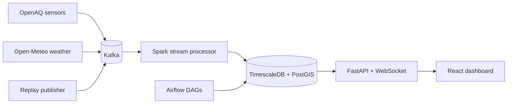

# HimalayaAir

HimalayaAir is a Kathmandu Valley air-quality intelligence platform built for real-time, fallback-safe operation.

## Architecture Overview

- Ingestion: OpenAQ sensors + Open-Meteo weather + fixtures.
- Streaming: Kafka message bus with Spark Structured Streaming processing.
- Storage: TimescaleDB/PostGIS with hypertables and continuous aggregates.
- Orchestration: Airflow DAGs for backfills, quality checks, and forecast recompute hooks.
- Serving: FastAPI REST + WebSocket for live feed updates.
- UI: React dashboard with live AQI signaling.



## Quick Start

1. Prepare environment values:

```bash
cp .env.example .env
```

2. Start core stack:

```bash
docker compose --profile core up -d
```

3. Optional streaming path for demo/bench tests:

```bash
docker compose --profile stream up -d
```

4. Verify health:

```bash
./scripts/verify_env.sh --profile core
```

## Profile Commands

```bash
docker compose --profile core up -d
docker compose --profile core --profile observed --profile stream up -d
docker compose --profile weather up -d
docker compose --profile batch up -d
docker compose --profile demo up replay-publisher
docker compose --profile full up -d
```

## Frontend Recovery

If `localhost:3000` shows the default Nginx page, run:

```bash
./scripts/reset_frontend.sh
```

This rebuilds and recreates only the `frontend` container, waits for health, and verifies the served HTML contains HimalayaAir markers (and not `Welcome to nginx`).

## Benchmark and Load-Test Commands

```bash
python benchmarks/seed_repro_data.py --compose-profiles core,stream --fixture fixtures/replay_sample.json
python benchmarks/query_benchmark.py --hours 72 --iterations 20 --warmup 3
python benchmarks/api_load_test.py --concurrency 20 --requests-per-user 20
```

Artifacts are written to `tmp/benchmark-results/*.json`.

## Environment Variables

The following table maps `.env.example` groups to active services.

| Group | Variables | Used by |
|---|---|---|
| Database | `POSTGRES_USER`, `POSTGRES_PASSWORD`, `POSTGRES_DB`, `DATABASE_URL`, `SYNC_DATABASE_URL` | TimescaleDB, API, Spark, Airflow, pollers |
| Airflow metadata | `AIRFLOW_POSTGRES_USER`, `AIRFLOW_POSTGRES_PASSWORD`, `AIRFLOW_POSTGRES_DB`, `AIRFLOW__CORE__EXECUTOR`, `AIRFLOW__DATABASE__SQL_ALCHEMY_CONN`, `_AIRFLOW_WWW_USER_USERNAME`, `_AIRFLOW_WWW_USER_PASSWORD` | Airflow services |
| Kafka | `KAFKA_BOOTSTRAP_SERVERS`, `KAFKA_CLUSTER_ID` | Kafka, API consumer, Spark, pollers, replay publisher |
| External APIs | `OPENAQ_API_KEY`, `FIRMS_MAP_KEY`, `FIRMS_SOURCE`, `FIRMS_AREA_BBOX`, `FIRMS_DAY_RANGE` | OpenAQ poller, Airflow FIRMS/backfill DAGs |
| Frontend | `VITE_API_BASE_URL`, `VITE_WS_URL`, `VITE_MAP_PROVIDER`, `VITE_MAPBOX_TOKEN`, `VITE_MAP_STYLE_URL` | Frontend build/runtime |
| Runtime | `LOG_FORMAT`, `ALLOWED_ORIGINS`, `DEMO_MODE_ALLOWED` | API and service behavior |
| FastAPI API | `API_FRESH_HOURS`, `API_RECENT_HOURS`, `API_MODELED_HOURS`, `API_STATION_CACHE_TTL_SECONDS`, `API_IDW_CACHE_TTL_SECONDS`, `API_IDW_ROWS`, `API_IDW_COLS`, `API_IDW_POWER`, `API_WEBSOCKET_HEARTBEAT_SECONDS`, `API_KAFKA_CONSUMER_ENABLED`, `API_KAFKA_HEALTH_ENABLED`, `API_EXTERNAL_HEALTH_ENABLED`, `API_KAFKA_GROUP_ID`, `API_KAFKA_RETRY_SECONDS`, `API_OPENAQ_HEALTH_URL`, `API_WEATHER_HEALTH_URL`, `API_MODELED_AQ_HEALTH_URL`, `API_EXTERNAL_HEALTH_TIMEOUT_SECONDS` | FastAPI |
| Host ports | `TIMESCALEDB_HOST_PORT`, `KAFKA_HOST_PORT`, `API_HOST_PORT`, `FRONTEND_HOST_PORT`, `AIRFLOW_POSTGRES_HOST_PORT`, `AIRFLOW_WEBSERVER_HOST_PORT`, `OPENAQ_POLLER_HOST_PORT`, `WEATHER_POLLER_HOST_PORT` | Local host mapping |
| OpenAQ poller | `OPENAQ_POLL_INTERVAL_SECONDS`, `OPENAQ_POLL_OVERLAP_MINUTES`, `OPENAQ_FALLBACK_LOOKBACK_HOURS`, `OPENAQ_MEASUREMENTS_LIMIT`, `OPENAQ_MAX_PAGES`, `OPENAQ_MAX_SENSORS`, `OPENAQ_HTTP_TIMEOUT_SECONDS`, `OPENAQ_HTTP_RETRIES` | OpenAQ poller |
| Open-Meteo pollers | `WEATHER_POLL_INTERVAL_SECONDS`, `OPENMETEO_AQ_POLL_INTERVAL_SECONDS`, `WEATHER_POLL_COMPONENTS`, `WEATHER_FORECAST_DAYS`, `WEATHER_PAST_DAYS`, `MODELED_AQ_FORECAST_DAYS`, `MODELED_AQ_PAST_DAYS`, `WEATHER_MAX_LOCATIONS`, `WEATHER_PUBLISH_KAFKA`, `OPENMETEO_HTTP_TIMEOUT_SECONDS`, `OPENMETEO_HTTP_RETRIES` | Weather pollers |
| Spark | `SPARK_CHECKPOINT_LOCATION`, `SPARK_STARTING_OFFSETS`, `SPARK_MAX_OFFSETS_PER_TRIGGER`, `SPARK_TRIGGER_PROCESSING_TIME`, `SPARK_PUBLISH_KAFKA` | Spark stream job |
| Airflow DAG runtime | `AIRFLOW_HTTP_TIMEOUT_SECONDS`, `AIRFLOW_HTTP_RETRIES`, `AIRFLOW_OPENAQ_BACKFILL_MAX_SENSORS`, `AIRFLOW_OPENAQ_BACKFILL_MAX_DAYS`, `AIRFLOW_WEATHER_BACKFILL_MAX_LOCATIONS`, `AIRFLOW_WEATHER_BACKFILL_MAX_MONTHS`, `AIRFLOW_QUALITY_FRESH_HOURS`, `AIRFLOW_QUALITY_RECENT_HOURS`, `AIRFLOW_QUALITY_DEAD_SENSOR_DAYS`, `_PIP_ADDITIONAL_REQUIREMENTS` | Airflow DAG tasks |
| Forecast | `FORECAST_POLLUTANTS`, `FORECAST_HORIZON_HOURS`, `FORECAST_HISTORY_DAYS`, `FORECAST_BIAS_DAYS`, `FORECAST_MIN_OBSERVED_COVERAGE`, `FORECAST_MIN_WEATHER_HISTORY_COVERAGE`, `FORECAST_MAX_STATIONS`, `FORECAST_DEFAULT_BASELINE_AQI`, `FORECAST_SARIMAX_ENABLED`, `FORECAST_PIPELINE_COMPONENT` | Forecast service + DAG hook |

## Verification Commands

```bash
./scripts/verify_env.sh
pytest -q
npm --prefix frontend run build
python benchmarks/query_benchmark.py || true
```

Expected outcomes:
- Compose verification reports profile service health.
- Pytest passes without regressions.
- Frontend build succeeds.
- Query benchmark writes JSON output (or records infra limitations if DB/services are unavailable).

## Screenshots

Use these paths for defense-ready captures:
- `docs/screenshots/dashboard-overview.png`
- `docs/screenshots/map-layers.png`
- `docs/screenshots/demo-mode.png`
- `docs/screenshots/forecast-panel.png`
- `docs/screenshots/pipeline-health.png`

Detailed instructions are in `docs/screenshots/README.md`.

## Limitations and Known Constraints

- Local Docker DNS/network issues can intermittently fail image builds or dependency install steps.
- Laptop CPU/RAM variance affects Spark latency and benchmark numbers.
- Public OpenAQ freshness can be sparse; system degrades gracefully when live data is sparse.
- Fixture data currently provides deterministic demo seeding, while richer DB-window selection remains future operational work.

## Additional Docs

- System source-of-truth: `docs/himalayaair-system-overview.md`
- Benchmark details: `docs/benchmark-results.md`
- Defense runbook: `docs/final-defense-script.md`
- Demo runbook: `docs/demo-script.md`
